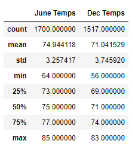

# surfs_up

Source:https://gfycat.com/slimcloudyamericanblackvulture-anastasia-ashley-surfer-model

## Overview

In order to determine if the surf and ice cream shop business is sustainable year-round. This project focused on the weather temperature in June and December in Oahu, Hawaii. Looking at different statistics between the two periods to help assess whether an ice cream and surf shop would have good weather conditions in which to operate.

## Results

1.	The average temperature between June and December is 75 and 71 degrees respectively, show a moderate temperature. June has a very little fluctuation of 4 degrees.
2.	The maximum temperatures in June was of 85  and 83 in December. These are also remarkably similar.
3.	
